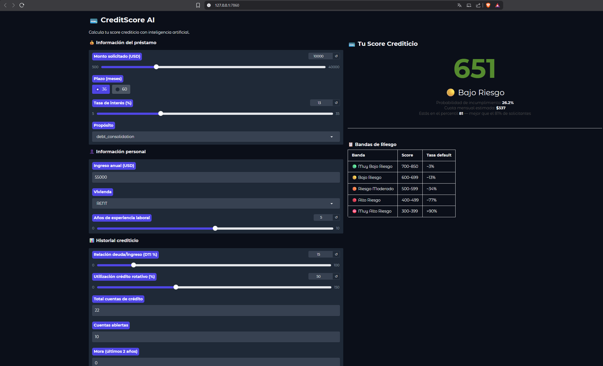

# Modelo de Riesgo de Crédito con Redes Neuronales

> Trabajo 2 — Inteligencia Artificial: Algoritmos Bioinspirados

## Descripción

Modelo de probabilidad de incumplimiento crediticio (_Probability of Default_) basado en redes neuronales artificiales, entrenado sobre el [Credit Risk Dataset de Kaggle](https://www.kaggle.com/datasets/ranadeep/credit-risk-dataset/data) (~887k registros, 74 variables).

El objetivo es predecir si un individuo incumplirá el pago de su crédito (`loan_status`), codificando la variable objetivo como:

| Categoría original                                                                       | Codificación       |
| ---------------------------------------------------------------------------------------- | ------------------ |
| `Fully Paid` / `Does not meet... Status:Fully Paid`                                      | `0` (buen pagador) |
| `Charged Off` / `Default` / `Late (31-120 days)` / `Does not meet... Status:Charged Off` | `1` (mal pagador)  |
| `Current`, `Issued`, `In Grace Period`, `Late (16-30 days)`                              | `NA` (excluidos)   |

## Entregables

- 📓 **Notebook**: EDA, modelo, scorecard y análisis de variables (`Modelo.ipynb`)
- 🌐 **App web**: Calculadora de score crediticio con Gradio (`app/app.py`)
- 📝 **Reporte técnico**: Publicado como entrada de blog

## Estructura del proyecto

```
red-neuronal-creditos/
├── Modelo.ipynb               # Notebook principal (EDA + modelo + scorecard)
├── app/
│   ├── app.py                 # Aplicación web (Gradio)
│   ├── best_model.pt          # Pesos del modelo entrenado
│   ├── preprocessor.pkl       # Pipeline de preprocesamiento
│   └── meta.pkl               # Metadatos del modelo
├── data/
│   └── loan.csv               # Dataset (no incluido en repo)
├── curva_perdida.png           # Curva de pérdida train/val
├── evaluacion_modelo.png       # ROC + matriz de confusión
├── scorecard_distribucion.png  # Distribución del score
├── importancia_variables.png   # Top 20 variables más importantes
├── requirements.txt
└── README.md
```

## Arquitectura del modelo

Red neuronal con PyTorch (256→128→64→1):

| Capa     | Neuronas     | Activación | Regularización          |
| -------- | ------------ | ---------- | ----------------------- |
| Entrada  | 147 features | —          | —                       |
| Oculta 1 | 256          | ReLU       | BatchNorm + Dropout 0.3 |
| Oculta 2 | 128          | ReLU       | BatchNorm + Dropout 0.3 |
| Oculta 3 | 64           | ReLU       | BatchNorm + Dropout 0.2 |
| Salida   | 1            | Sigmoid    | —                       |

- **Optimizador**: Adam (lr=0.001, weight_decay=1e-5) + ReduceLROnPlateau
- **Pérdida**: BCEWithLogitsLoss con `pos_weight=3.57` (desbalance de clases)
- **AUC-ROC**: 0.7160 (vs. baseline Regresión Logística: 0.7059)

## Instalación y uso

```bash
# Clonar el repositorio
git clone https://github.com/itsFr4nc0/red-neuronal-creditos.git
cd red-neuronal-creditos

# Instalar dependencias
pip install -r requirements.txt

# Ejecutar el notebook (requiere data/loan.csv)
jupyter notebook Modelo.ipynb

# Ejecutar la app web
python app/app.py
```

La app abre automáticamente en `http://127.0.0.1:7860`

## Dependencias principales

- `torch` — Red neuronal
- `scikit-learn` — Preprocesamiento y métricas
- `gradio` — Aplicación web
- `pandas`, `numpy`, `matplotlib`, `joblib`


